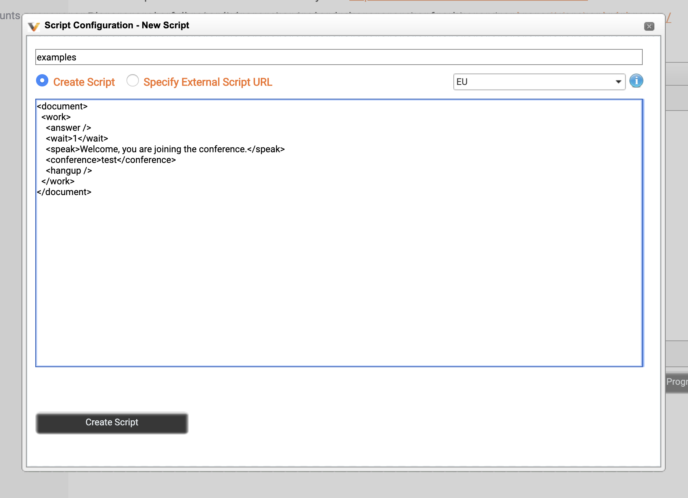
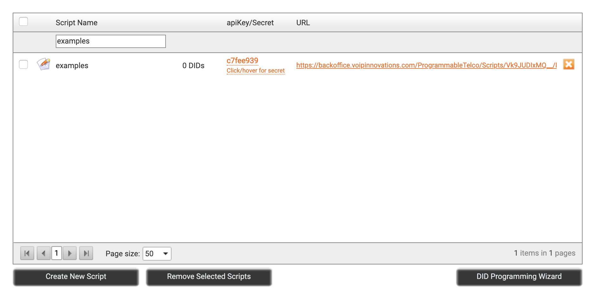
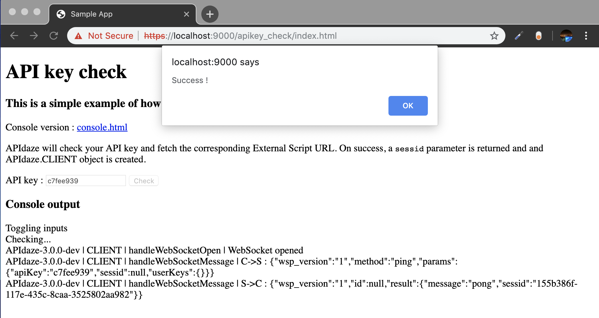

# [APIdaze](https://voipinnovations.com/programmable) Javascript API

This library enables users to make calls, video conferences, automated voice responses, send DTMF (dual-tone multi-frequency) signaling and [more](https://voipinnovations.com/programmable) provided by APIdaze on a browser environment.

Actions, such as calling a number, making a video conference, are not defined by APIdazeJS, but an XML script called "External Script". Therefore, whenever an action is triggered with the SDK, it will only play a role which sends the given data to an External Script and handles media streams. Which means, what will happen during a call or afterwards will reside in the External Script itself.

For further details, [the documentation](https://vi-api.trybelabs.com/?version=latest) can be checked.

# Installation

Either execute in your project directory\
`npm install apidaze-js`\
and add to your code\
`const APIdaze = require('apidaze-js')`

or add a html tag\
`<script src="https://api4.apidaze.io/javascript/releases/APIdaze-3.0.0-dev-master.js" />`\
and the SDK can be called as `APIdaze` in your code.

# Usage

Make sure you can access [this page](https://backoffice.voipinnovations.com/ProgrammableTelco/ExternalScripts.aspx) that is used to define External Scripts.\
If you don't have an account, you can create one [here](https://backoffice.voipinnovations.com/SignUp/Packages.aspx).\
To initialize a client, follow [these instructions](https://vi-api.trybelabs.com/?version=latest#6bf958bf-5ab5-6db9-7dd5-21f415ae413d).\
And to read more about possibilities of External Scripts, go [here](https://vi-api.trybelabs.com/?version=latest#21716538-c967-9c7b-bb24-60ca07bc004a).

# How to run samples

1. Visit https://backoffice.voipinnovations.com/ProgrammableTelco/ExternalScripts.aspx
2. Click create new script button
3. Enter the name of your choice and this content of External Script
```xml
<document>
  <work>
    <answer />
    <wait>1</wait>
    <speak>Welcome, you are joining the conference.</speak>
    <conference>test</conference>
    <hangup />
  </work>
</document>
```

4. Click create script, wait for cofirmation, close the editor\
5. Find script by the name and copy the visible apiKey (c7fee939 on screenshot)

6. Clone repository; `git clone https://github.com/apidaze/apidaze-js.git`\
7. Install dependencies in the repository folder; `npm install`\
8. Start a web server; `npm run start`\
9. Open https://localhost:9000 \
10. Warning about missing certificate will be displayed, click "advanced" and "proceed to localhost (unsafe)"\
11. Select "API key check" from list of examples\
12. Type `apiKey` from step 4. and click "check" button

If all goes well, the result should look like this



# How to contribute

1. Fork this repository
2. Make a copy of file called `cypress/config.template.js` and name it as `cypress/config.js` and provide the [`apiKey`](#how-to-run-examples) to it
3. Work on your change
4. When ready, please verify that code is matching linter and tests are passed by concurrently running `npm run start` and `npm run test:all`
5. If integration tests are failing use `npm run cypress` to find a reason
6. When all tests are passed, create a pull request
